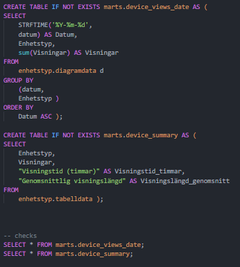

# Dokumentera i en markdown de olika skripten och dess funktionalitet i backenden.

---

- ### **change_name_data.py**
>

change_name_data.py ändrar namnet på tidigare raw_data mappen från långa namn till kortare mera lätt arbetliga namn såsom "Datum XX_XX_XXXX" till den första meningen i varje mappen med split()[0], alltså "Datum XX_XX_XXXX" -> "Datum" sedan skapar cleaned data mappen om den redan existerar tar den bort den nuvarande bearbetande datan och gör ingen förändring. (tror du hörde diskussionen med Milton om hur man kunde göra det annorlunda.)

---

- ### **constants.py**
>

constants.py vår path till youtube_data och cleaned data tillkallas som DATABASE_PATH och CLEANED_DATA_PATH senare i skripten.

---

- ### **database.py**
>

database.py öppnar en connection till vår databas för att sedan stänga den.

---

- ### **ingest_data_to_database.py**
>

ingest_data_to_database.py ändra alla "å,ä,ö" till a respektive o ändra alla stora bokstäver till små och dela vid varje punkt sedan skapar den ett schema om den inte redan existerar och skapar en tabell med information ifrån vår path.

---

- ### **EDA.sql**
>

EDA.sql tar tabelller och skapar dom med namnet tabelldata och totalt, OFFSET hoppar över en rad
STRFTIME(har vi gått igenom detta?) är SQLs variant av datetime alltså den ändrar till datum år-månad-dag i detta fallet.

Så detta script tar data för datum och visningstid och sorterar det sen i fallande ordning.     

---

- ### **marts_content.sql**
>

marts_content.sql väljer relevant data inom vår db om youtube videos såsom, titel, visningar, prenumeranter osv.

---

- ### **marts_device.sql**
>

marts_device.sql skapar två tabeller en för visningar per datum och en med visningtid med genonsnittlig visningslängd.

---