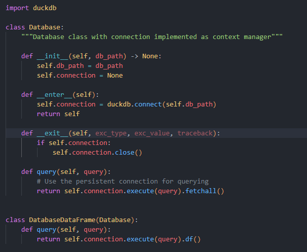

# Dokumentera i en markdown de olika skripten och dess funktionalitet i backenden.

---

- ### **change_name_data.py**
>

change_name_data.py 

---

- ### **constants.py**
>

constants.py

---

- ### **database.py**
>

database.py

---

- ### **ingest_data_to_database.py**
>

ingest_data_to_database.py

---

- ### **EDA.sql**
>

EDA.sql

---

- ### **marts_content.sql**
>

marts_content.sql

---

- ### **marts_device.sql**
>

marts_device.sql

---